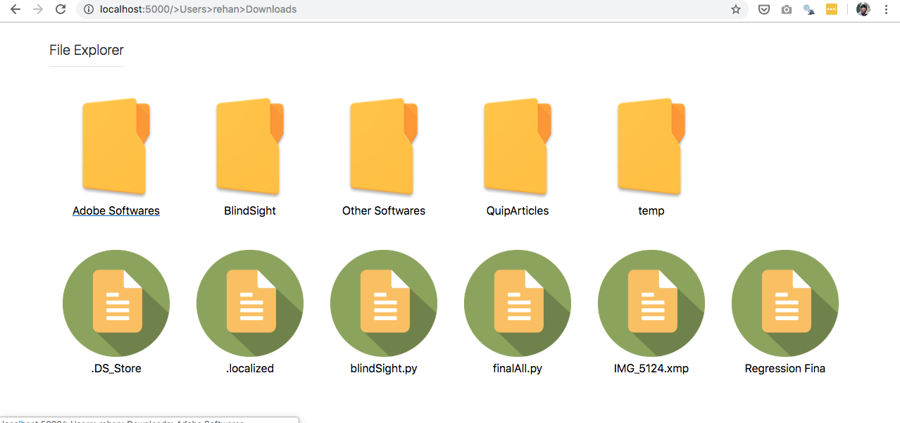

# File Explorer Server #

A file explorer that works over local area network (Wi-Fi/Ethernet) using Flask server. You can explore a computer's complete directory and download any file. Moreover, it also lets you stream videos or audio files if your browser supports it.

Server works on,
- Windows
- Linux
- Mac

I have written it in Python and tested it on Mac using the following web frameworks,

**Frameworks**
-
- Flask (Server)
- Bootstrap 4 

Flask has been used to run the server and serve up the html pages. Meanwhile, Bootstrap has been used to show the Folders and the Files. To open any folder, just click on it and to download/stream any file, just click on it.

**How to Run**
-
Clone this repository by using,
    
    git clone https://github.com/reallyrehan/flask-fileexplorer.git

Make sure you have flask installed. You can use the following command to install flask,

    pip install Flask
    
Now, open terminal/command prompt in the flask-fileexplorer directory and run the setup.y file by using the following command,

    python setup.py
    
This should start the Flask Server in your terminal window. You can access it by going to,
- **localhost:5000** (on your server's browser)
- **(IP Address of your Server):5000** (from any other browser on the same network)

For additional features,

- **Password Protection**: Set a password in the config.json file.
- **Hiding Folders**: Add paths of folders to hide in the config.json file as a list.
- **Favorite Folders**: Add paths to add as favorites in the config.json file as a list.
- **Share only Specific Folder**: Give a path to the Root Directory or leave it as default '/' to share the complete computer directory.

## Issues ##

- [x] Change File icons 
- [ ] Implement Video Streaming Works Already
- [ ] Implement Back/Forward Button 
- [ ] Upload Button	
- [ ] Add Download Folder option (Zip folder)
- [x] Add Security Features Added Hiding ()
- [x] change to setup.py 
- [x] Remove inline css to separate css file Partially 
- [x] Add Favorites 
- [x] Fix Mobile CSS 
- [x] Share only specific folder 
- [ ] Take path from command line
- [ ] Add How to find IP Address (ISSUE)
- [ ] Test on Linux
- [x] Test on Windows
- [x] Add Error Handling 
- [x] Add Login Page Current Directory and Password 
- [ ] Add Hidden Validation
- [ ] Add Favorites Validation
- [ ] ISSUE: Favorites doesnt work with Limited Directory Usage
- [ ] Add Breadcrumb path
- [ ] Back Button
- [x] Add a proper Config file for all configrations hidden, favorites, login 
- [ ] Add Exit Button
- [ ] Describe how to get your own IP address for Mac, Windows, Linux
- [ ] Add username and create a log file to track accesses and each executed instruction
- [ ] Add homepage for selecting available Drives
